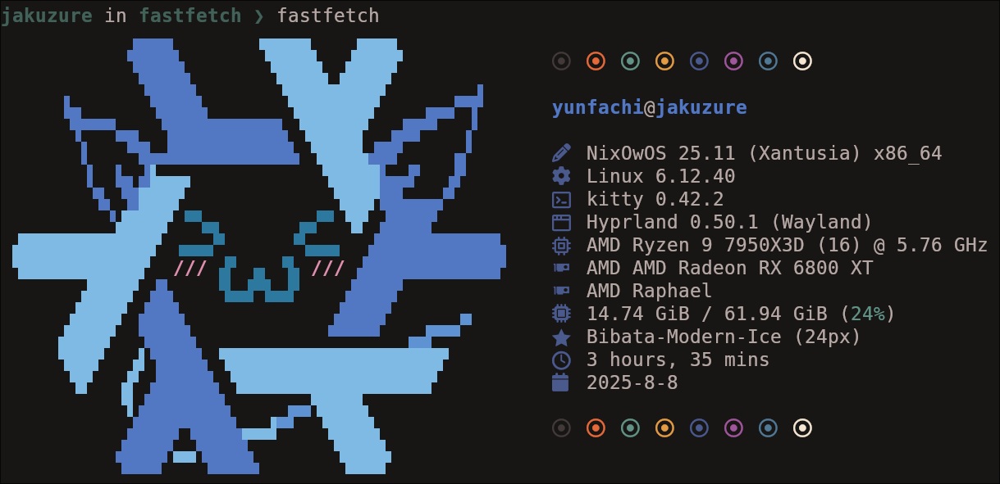

<p align="center">
  
</p>

A complete redesign of NixOS into **NixOwOS**, featuring updated logos, renamed distro, and more.

## Screenshots

<p align="center">
  <a href="./assets/screenshots/fastfetch.png"></a>
</p>

## Usage

A full list of available NixOS module options can be found in [./nixos-options.md](./nixos-options.md).

A full list of available Home Manager module options can be found in [./home-options.md](./home-options.md).

## Installation (NixOS, Home Manager)

### With Flakes

To enable NixOwOS, add `inputs.nixowos` to your Flake and import both the NixOS and Home Manager modules - if you use them both. Otherwise, just import the module you need.

```nix
{
  inputs = {
    nixowos = {
      url = "github:yunfachi/nixowos";
      # Optional:
      # inputs.nixpkgs.follows = "nixpkgs";
      # inputs.denix.follows = "denix";
    };
  };

  outputs = { nixpkgs, home-manager, nixowos, ... }:
    {
      nixosConfigurations.nixos = nixpkgs.lib.nixosSystem {
        modules = [
          # ...
          nixowos.nixosModules.default
          {
            home-manager.users.MYUSER.imports = [
              nixowos.homeModules.default
            ];
          }
        ];
      };
      
      homeConfigurations.standaloneHomeManagerConfig = home-manager.lib.homeManagerConfiguration {
        modules = [
          # ...
          nixowos.homeModules.default
        ];
      };
    };
}
```

Next, enable NixOwOS by adding this to your NixOS and Home Manager configurations:

```nix
{
  nixowos.enable = true;
}
```

If you use both NixOS and Home Manager, add it to **both** configurations. Otherwise, add it only to the one you're using.

### Without Flakes

Import directly from the Git repository:

```nix
{ pkgs, lib, ... }:
let
  nixowos = import (builtins.fetchGit {
    url = "https://github.com/yunfachi/nixowos";
  });
in 
{
  imports = [
    nixowos.nixosModules.default
    # or, if you're using Home Manager:
    # nixowos.homeModules.default
  ];

  # Enable NixOwOS
  nixowos.enable = true;
}
```

## License

### Project  
Licensed under the [MIT License](./LICENSE).

### Assets  
All files in [`assets/`](./assets/) are licensed under the [Creative Commons Attribution 4.0 International License](./assets/LICENSE).

**Asset credits:**  
- **Base artwork**: Official NixOS logo  
  - Source: https://github.com/NixOS/nixos-artwork/tree/master/logo  
  - License: CC-BY-4.0  
  - Original design by [Simon Frankau](https://arbitrary.name/) (@simon-frankau), revised by [Tim Cuthbertson](https://gfxmonk.net/) (@timbertson)  
- **Modified (uwu style)**: [u/ant-arctica](https://www.reddit.com/user/ant-arctica/)  
  - Reference: https://www.reddit.com/r/linuxmasterrace/comments/lzdwl4/nixowos/  
  - License: CC-BY-4.0  

**Full license texts:**  
- MIT: https://opensource.org/licenses/MIT  
- CC-BY-4.0: https://creativecommons.org/licenses/by/4.0/
